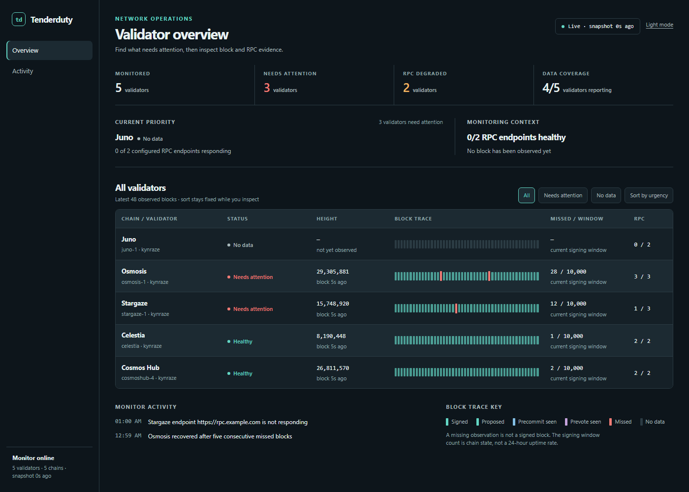

# TenderDuty v2

[](https://pkg.go.dev/github.com/kynraze/tenderduty/v2)
[](https://github.com/kynraze/tenderduty/actions?query=workflow%3AGosec)
[](https://github.com/kynraze/tenderduty/actions?query=workflow%3ACodeQL)

Fork of [blockpane/tenderduty](https://github.com/blockpane/tenderduty) maintained by [Kynraze](https://github.com/kynraze). What's different:

- New dashboard with filters, chain details and themes
- Alerting fixes: no false alerts after restarts, PagerDuty incidents resolve, alerts survive state file problems
- Realio multistaking: several validators on one chain, each with its own nodes
- Go 1.27 and updated dependencies, configs from the original still load
- Docker image at `ghcr.io/kynraze/tenderduty`

Tenderduty is a comprehensive monitoring tool for Tendermint chains. Its primary function is to alert a validator if they are missing blocks, and has many other features.

v2 is complete rewrite of the original tenderduty graciously sponsored by the [Osmosis Grants Program](https://grants.osmosis.zone/). This new version adds a web dashboard, prometheus exporter, telegram and discord notifications, multi-chain support, more granular alerting, and more types of alerts.



## Documentation

The [documentation](docs/README.md) is a work-in-progress.

## Dashboard Appearance

Open **Customize** in the web dashboard to choose Graphite, Midnight, Paper, or Warm Stone. Select **Custom** to set background, panel, and accent colors using color pickers or six-digit HEX values.

Changes preview immediately. **Apply** saves your preferences in this browser, **Cancel** discards the preview, and **Reset** previews the default Graphite theme. Click **Apply** after resetting to save the default.

Text and status colors adapt to the selected palette. Color combinations that make labels or controls difficult to read cannot be applied. Preferences are local to each browser and do not require changes to `config.yml`. If browser storage is unavailable, preferences last for the current session.

## Runtime options:

```
$ tenderduty -h
Usage of tenderduty:
  -example-config
    	print the an example config.yml and exit
  -f string
    	configuration file to use (default "config.yml")
  -state string
    	file for storing state between restarts (default ".tenderduty-state.json")
  -cc string
    	directory containing additional chain specific configurations (default "chains.d")
```

## Installing

Detailed installation info is in the [installation doc.](docs/install.md)

### Docker

Build this fork's image if you already have Docker installed:

```
mkdir tenderduty && cd tenderduty
docker run --rm ghcr.io/kynraze/tenderduty:latest -example-config >config.yml
# edit config.yml and add chains, notification methods etc.
docker run -d --name tenderduty -p "8888:8888" -p "28686:28686" --restart unless-stopped -v tenderduty-state:/var/lib/tenderduty -v $(pwd)/config.yml:/var/lib/tenderduty/config.yml ghcr.io/kynraze/tenderduty:latest
docker logs -f --tail 20 tenderduty
```

### Build from source

Install Git and Go 1.27.1 or later, then clone and build this fork:

```shell
git clone --branch main https://github.com/kynraze/tenderduty.git
cd tenderduty
go mod download
go build -mod=readonly -ldflags '-s -w' -trimpath -o tenderduty .
cp example-config.yml config.yml
# edit config.yml and add chains, notification methods etc.
./tenderduty -f config.yml
```

See [building from source](docs/install.md#building-from-source) for Go installation instructions.

### Run with systemd

On Ubuntu, build the binary as shown above and stop the foreground process before installing the service. From the repository directory:

```shell
# skip useradd if the tenderduty user already exists
sudo useradd --system --user-group --home-dir /var/lib/tenderduty --shell /usr/sbin/nologin tenderduty
sudo install -m 0755 tenderduty /usr/local/bin/tenderduty
sudo install -d -m 0750 -o root -g tenderduty /etc/tenderduty /etc/tenderduty/chains.d
sudo install -m 0640 -o root -g tenderduty config.yml /etc/tenderduty/config.yml
sudo install -m 0644 contrib/tenderduty.service /etc/systemd/system/tenderduty.service
sudo systemd-analyze verify /etc/systemd/system/tenderduty.service
sudo systemctl daemon-reload
sudo systemctl enable --now tenderduty
sudo systemctl status tenderduty --no-pager
```

One service monitors all configured chains. It runs as the `tenderduty` user, stores state in `/var/lib/tenderduty`, and starts automatically at boot. Follow logs with `sudo journalctl -u tenderduty -f` and restart after configuration changes with `sudo systemctl restart tenderduty`.

See the [systemd guide](docs/install.md#run-as-a-systemd-service-on-ubuntu) for separate chain files and dashboard access through an SSH tunnel.

Dependency upgrade details and remaining migration work are listed in the [dependency notes](docs/dependency-upgrades.md).

## Split Configuration

Shared alert settings go in `alert_defaults`, each chain's `alerts` only needs what's different. See the [configuration guide](docs/config.md), including Realio multistaking support.

For validators with many chains, chain specific configuration may be split into additional files and placed into the directory "chains.d".

This directory can be changed with the -cc option. See [examples/](examples) to get started.

The user friendly chain label will be taken from the name of the file.  

For example:

```
chains.d/Juno.yml -> Juno
chains.d/Lum Network.yml -> Lum Network
chains.d/Osmosis.mainnet.yml -> Osmosis
```

The label ends at the first dot.

Configuration inside chains.d/Network.yml will be the YAML contents without the chain label.

For example start directly with:

```
chain_id: demo-1
    valoper_address: demovaloper...
```

## Contributions

Contributions are welcome, please open pull requests against the `main` branch of [kynraze/tenderduty](https://github.com/kynraze/tenderduty).

